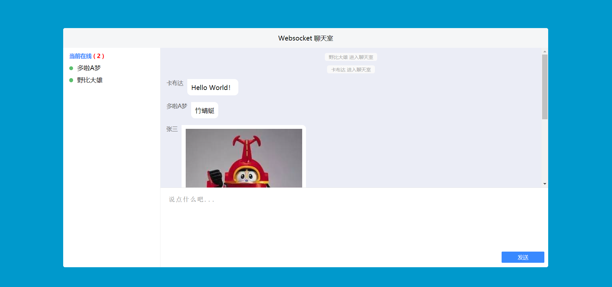

# websocket demo

该项目为为练习 websocket 调用而开发的基于 express 和 socket.io 搭建的简易聊天室项目。

## 如何开始

* 请先安装本地 [Node](https://nodejs.org/en/) 环境，要求 node 版本不低于 8.0.0
* 克隆地址: `git clone https://github.com/humiao7/websocket-demo.git`
* 安装 npm 依赖: `npm install`
* 启动 express 服务端服务，在项目根目录执行: `npm run serve`
* 打开 `http://localhost:3000`访问服务

## 目录结构

```
├─websocket-demo
│      .gitignore
│      index.html
│      package.json
│      README.md
│      server.js
```

# 效果预览

